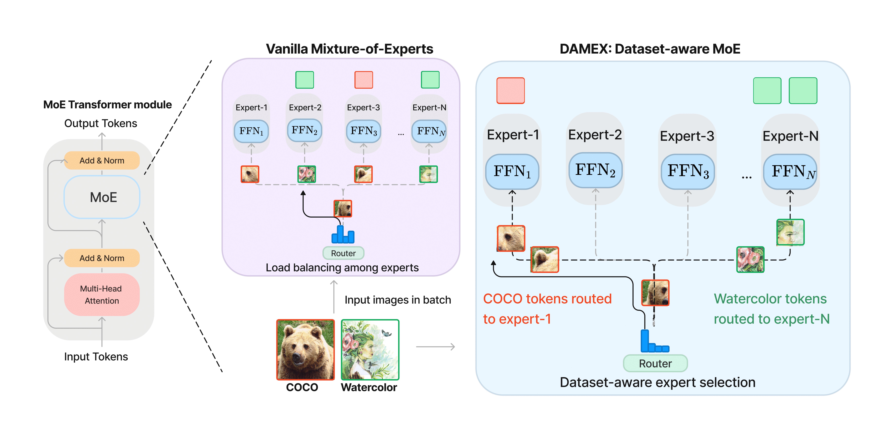

# DAMEX: Dataset-aware Mixture-of-Experts for visual understanding of mixture-of-datasets
### [Paper](https://arxiv.org/abs/2311.04894) | [Data](data/README.md) 
PyTorch implementation of DAMEX, a dataset-aware Mixture-of-Experts architecture that learns dataset-specific experts inside a single architecture<br>

[DAMEX: Dataset-aware Mixture-of-Experts for visual understanding of mixture-of-datasets](https://arxiv.org/abs/2311.04894)  
 [Yash Jain](https://www.linkedin.com/in/jinga-lala/)<sup>1</sup>,
[Harkirat Behl](https://harkiratbehl.github.io/)<sup>2</sup>. 
 [Zsolt Kira](https://faculty.cc.gatech.edu/~zk15/)<sup>1</sup>,
 [Vibhav Vineet](https://vibhav-vineet.github.io/)<sup>2</sup>,
<br>
 <sup>1</sup>Georgia Institute of Technlogy, <sup>2</sup>Microsoft Research  <br>


## Quickstart :rocket:

Follow the instructions below to train DAMEX on the UODB datasets. The codebase assumes one expert per gpu but this can be tweaked in `tutel` library and `models/dino/moe.py`. 

### Set up a conda environment:
```
conda env create -n damex
conda activate damex
pip install -r requirements.txt


# download local copy of tutel
python3 -m pip install --user --upgrade git+https://github.com/microsoft/tutel@v0.2.1

# setup dino
cd models/dino/ops
python setup.py build install --user
cd ../../..
pip uninstall protobuf -y
pip install protobuf==3.20.3
```

### Set up data
All the datasets need to be in COCO format. Download the dataset from the UODB website [Universal Object-detection Benchmark](http://www.svcl.ucsd.edu/projects/universal-detection/) and place the annotation json downloaded from [drive link](https://drive.google.com/drive/folders/1WgBeJY6wZCp4lIaKQLj1ajUXIUDbZ_MI?usp=sharing) inside the `Annotations` folder for non-COCO datasets.
The directory structure should be like
```
  uodb/
    clipart/
      Annotations/
      JPEGImages/
      ...
    comic/
      Annotations/
      JPEGImages/
      ...
    coco/
      ...
    ...
```
### Training on UODB set:
```
python -m torch.distributed.launch --nproc_per_node=8 main.py \
      --config_file config/DINO/uodb/DAMEX_4scale.py \
      --damex \
      --options batch_size=1 save_checkpoint_interval=4 epochs=36 lr=0.00014 \
      --output_dir ./output/uodb/expt \
      --coco_path $$DATA_DIR/uodb/ \
      --datasets clipart coco deeplesion dota kitchen lisa watercolor widerface kitti voc07 voc12 comic  \ # name of datasets

# Optionally, you can use wandb to monitor experiments, need WANDB_API_KEY in main.py
# --use_wandb --run_group expt 

```
The dataset mapping of DAMEX is currently hard-coded in [`datasets/dataset.py`](datasets/dataset.py) file as `dataset_map`. The comments and examples will help you understand the mapping. If you find a more amicable solution to it then please feel free to raise a PR.


## BibTeX

```
@article{jain2024damex,
  title={DAMEX: Dataset-aware Mixture-of-Experts for visual understanding of mixture-of-datasets},
  author={Jain, Yash and Behl, Harkirat and Kira, Zsolt and Vineet, Vibhav},
  journal={Advances in Neural Information Processing Systems},
  volume={36},
  year={2024}
}
```
## Comments
Thank you for working with DAMEX. :smile:

